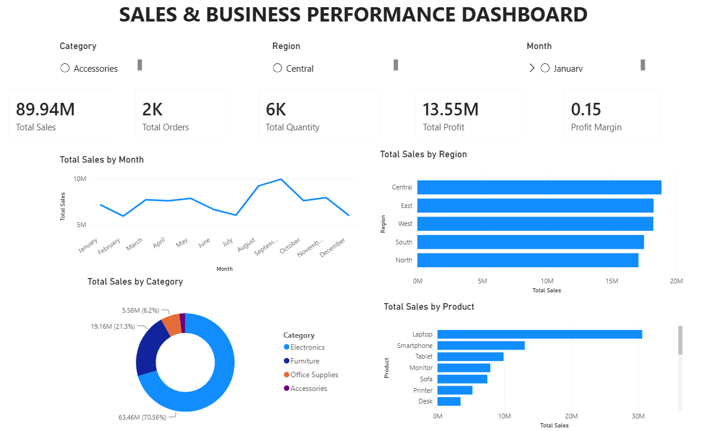

# Sales & Business Performance Dashboard

## 📊 Project Overview

An interactive Power BI dashboard developed to analyze business
sales performance across different regions, categories, products,
and months.

## 🛠️ Tools & Technologies

- Power BI
- DAX
- Power Query
- Excel/CSV

## 📈 Dashboard Features

- Total Sales KPI
- Total Profit KPI
- Total Orders KPI
- Total Quantity KPI
- Profit Margin KPI
- Monthly Sales Trend
- Sales by Region
- Sales by Category
- Sales by Product
- Interactive slicers

## 📌 Key Insights

- Analyzed monthly sales trends.
- Compared sales performance across regions.
- Identified high-performing product categories.
- Identified top-performing products.
- Analyzed overall profit and sales performance.

## 🖼️ Dashboard Preview

